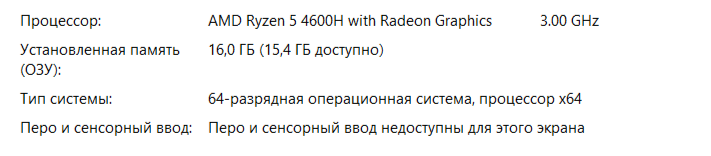
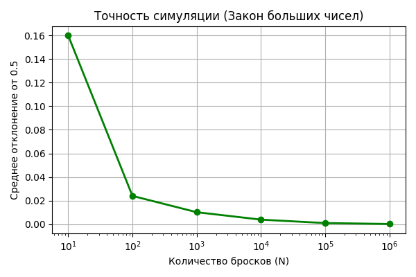
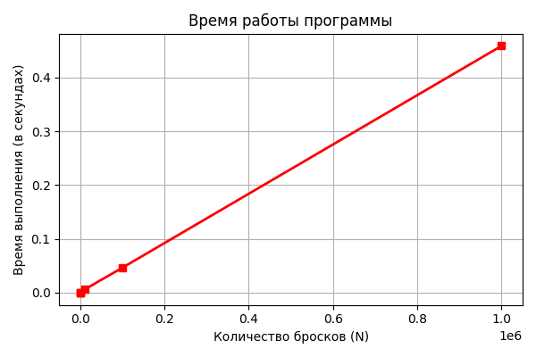

1. Гафаров Гадель Фаилевич

2. Лабораторная работа №1
Моделирование бросков монеты: Исследование закона больших чисел

3. Цель Лабораторной работы --- 
1 - Научиться работать с модулем random, закрепить навыки работы с циклами и условиями
2 - Научиться работать с модулем time для вычисления времени работы программы
3 - Проверить закон больших чисел

4. Оборудование --- Ноутбук 

5. Краткая теория --- Закон больших чисел — это принцип в теории вероятностей, согласно которому при многократном повторении одного и того же эксперимента средний результат стремится к ожидаемому (теоретическому) значению.
Мы проверили его с помощью эксперимента при бросании монетки. При большем количестве бросаний количество выпадения орла и решки были почти одиннаковы

6. Для начала я написал функцию которая "бросает" монетки где шанс выпадения орла и решки равен
После я сделал функцию для нахождения частоты, отклонения и времени выполнения функции
Дальше сделал в функции нахождение средних значений частоты , отклонения и времени
В конце я начал строить графики

7. Результат --- # Задание 1
import random, time
import matplotlib.pyplot as plt

n_values = [10, 100, 1000, 10000, 100000, 1000000]
for n in n_values:
    def flip_coin(n):
        heads_count = 0
        for i in range(n):
            chance = random.randint(0, 1)
            if chance == 1:
                heads_count += 1
        return heads_count

    # Задание 2

    def run_single_experiment(n):
        start_time = time.perf_counter()
        
        heads = flip_coin(n)
        
        end_time = time.perf_counter()
        
        elapsed_time = end_time - start_time
        
        frequency = heads / n
        
        deviation = abs(frequency - 0.5)
        
        return frequency, deviation, elapsed_time
        

    # Задание 3

    count_heads = []
    otclonenie = []
    time_list = []

    def run_series(n, num_runs = 5):
        for i in range(num_runs):
            frequency, deviation, elapsed_time = run_single_experiment(n)
            print(frequency)
            count_heads.append(frequency)
            otclonenie.append(deviation)
            time_list.append(elapsed_time)
        average_value_heads = sum(count_heads) / len(count_heads)
        average_value_otclonenie = sum(otclonenie) / len(otclonenie)
        average_value_time = sum(time_list) / len(time_list)
        max_time = max(time_list)
        min_time = min(time_list)
        return average_value_heads , average_value_otclonenie, average_value_time, max_time, min_time

# --- 1. Готовим данные для графиков ---
# По оси X у нас количество бросков монеты (N)
n_values = [10, 100, 1000, 10000, 100000, 1000000]

# По оси Y для первого графика — средние отклонения
# ВНИМАНИЕ: Замените эти цифры на результаты ваших собственных измерений из таблицы!
deviations = [0.16, 0.02400000000000001, 0.01020000000000001, 0.0038999999999999924, 0.0009939999999999838, 0.00022479999999999167]

# По оси Y для второго графика — среднее время работы в секундах
# ВНИМАНИЕ: Замените эти цифры на ваши замеры времени!
times = [0.000002480000077630393, 0.000057999999808089345, 0.00043931999971391633, 0.005635720000100264, 0.04627734000005148, 0.4589369400000578]

# --- 2. Строим первый график (Точность симуляции) ---
plt.figure(figsize=(6, 4)) # Создаем окно для графика размером 6 на 4 дюйма

# Рисуем линию графика:
plt.plot(n_values, deviations, marker='o', color='green', linewidth=2)
# marker='o' — ставит круглые точки в местах наших замеров
# color='green' — красит линию в зеленый цвет
# linewidth=2 — делает линию более жирной и заметной

# Настраиваем оси:
plt.xscale('log') # Включаем логарифмический масштаб для оси X,
                  # чтобы точки 10, 100, 1000 и 1000000 стояли на равном расстоянии друг от друга

# Подписываем график и оси:
plt.title('Точность симуляции (Закон больших чисел)')
plt.xlabel('Количество бросков (N)')
plt.ylabel('Среднее отклонение от 0.5')
plt.grid(True) # Включаем сеточку на заднем фоне, чтобы было легче смотреть значения

plt.tight_layout() # Делаем так, чтобы все подписи влезли в картинку
plt.savefig('chart_deviation.png') # Сохраняем график на компьютер как картинку
plt.show() # Показываем график на экране

# --- 3. Строим второй график (Производительность программы) ---
plt.figure(figsize=(6, 4)) # Создаем новое окно для второго графика

# Рисуем линию графика времени:
plt.plot(n_values, times, marker='s', color='red', linewidth=2)
# marker='s' — ставит квадратные точки (square)
# color='red' — красит линию в красный цвет

# Подписываем график и оси:
plt.title('Время работы программы')
plt.xlabel('Количество бросков (N)')
plt.ylabel('Время выполнения (в секундах)')
plt.grid(True) # Тоже включаем сетку

plt.tight_layout()
plt.savefig('chart_time.png') # Сохраняем второй график как картинку
plt.show() # Показываем на экране

8. Результаты эксперимента --- 

1.Таблица --- 

2. 

3.
1. Среднее отклонение уменьшается при увеличении количества бросков что подтверждает закон больших чисел
2. Время работы программы линейная при увеличении или уменьшении количества бросков
Если мы увеличим количество бросков в 10 раз то время выполнения вырастет примерно в 10 раз
3. 
На скорость влияет если при броске выпадает орёл , то у нас проводится функции которые занимают время, а при выпадении решки никакие функции не выполняются , что не тратит время
Поэтому при 10 бросках разница между max_time и min_time большая, а при 1000000 бросках разница между max_time и min_time маленькая

9.1. Теоретическая вероятность «решки» и влияние предыдущих бросков
Теоретическая вероятность выпадения «решки» у симметричной (честной) монеты составляет ровно 1/2 (или 50%).

Вероятность НЕ изменится, даже если перед этим 5, 50 или 500 раз подряд выпал «орел».

Почему?
Монета не имеет памяти. Она не знает, что выпадало до этого. Каждый бросок — это независимое событие. Вероятность остаётся 50/50 на каждый следующий бросок.

2. Закон больших чисел (своими словами)
Закон больших чисел гласит:
Если вы делаете очень много одинаковых независимых испытаний, то средний результат этих испытаний становится всё ближе и ближе к теоретическому ожидаемому результату. Но это работает только на дистанции — маленькие выборки могут сильно отличаться.

3. Почему для N=10 частота колеблется, а для N=1 000 000 — почти всегда 0.5?
Всё дело в дисперсии (разбросе) относительно ожидаемого числа.

Для N=10: Отклонение в 20% от 50% здесь — обычное дело, поэтому от запуска к запуску картинка сильно скачет.

Для N=1 000 000: Относительный разброс (в процентах) считается как 500 / 1 000 000 = 0.0005 (т.е. 0.05%).
То есть частота орлов будет почти гарантированно лежать в промежутке от 49.95% до 50.05%. Отклонение в тысячные доли процента — это незаметно глазу, поэтому результат всегда стабилен.

4. Зачем делать по 5 запусков для каждого N, а не один?
Это делается для оценки стабильности (воспроизводимости) результата и для расчета доверительного интервала.

Если мы сделаем 1 запуск при N=10 и получим 4 орла (40%), мы не поймём: это случайность или монета кривая? А если мы сделаем 5 запусков и увидим результаты: 40%, 70%, 30%, 60%, 50% — мы сразу увидим, что разброс колоссальный, и доверять одному числу нельзя.

Это позволяет вычислить погрешность (стандартную ошибку среднего).
Если учёный проводит эксперимент один раз и получает результат, никто ему не поверит. Если он проводит 5 раз и получает почти одинаковые цифры — это говорит о надёжности метода. Множественные запуски — это защита от «везения» или «невезения» в одной конкретной выборке.

5. Разница между random.randint(0, 1) и random.random()
random.randint(0, 1) — возвращает целые числа: 0 или 1 (дискретный результат).

random.random() — возвращает вещественное (дробное) число в промежутке от 0.0 до 1.0 (например, 0.734). Чтобы получить орла/решку, вам придётся вручную добавлять условие: if random.random() < 0.5: орел else: решка.

Какую удобнее использовать для симуляции броска монеты?
random.randint(0, 1) — удобнее, потому что она сразу даёт готовый целочисленный код исхода (0 или 1), без лишних сравнений с дробями. Код становится короче и читаемее

10. Вывод --- Сделав свою программу я подтвердил закон больших чисел. Я научился строить графики и работать с random
Строить таблицы 
